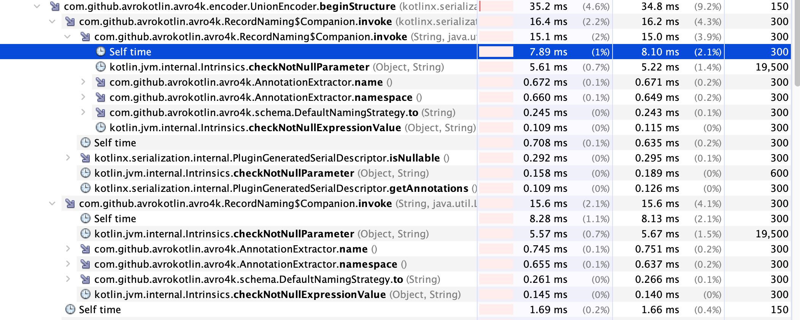

Simple benchmark to compare the performance of Avro4K, Jackson JSON and Jackson AVRO.

Avro4K is as much as 2-3x slower in both serialization and deserialization than Jackson AVRO when
unions are involved.
A significant amount of CPU time was spent in the
`RecordNaming.invoke(String, List<Annotation>, NamingStrategy)` method of Avro4K.

Use `gradle run` to run the benchmark.
